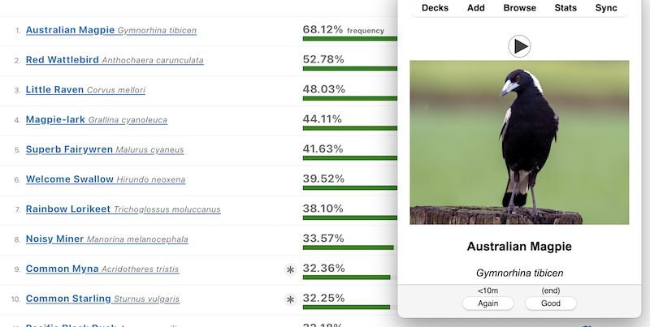

# ebird2anki

Generate [Anki](https://apps.ankiweb.net/) cards from [eBird](https://ebird.org/home) media.



This a dirty collection of scripts. TODO: I might streamline it if I end up using it a lot, but no plans to right now.

Each card prompts you with a photo or audio recording of a bird. The answer shows both photo and audio, and the bird's common and scientific names.

## "Install"

### Requirements

1. An eBird account to generate the bird list
2. Anki
3. [Node](https://nodejs.org/en)
4. [wget](https://www.gnu.org/software/wget/) (TODO: I really should write the whole thing in Node and get rid of that dependency)
5. [git-lfs](https://git-lfs.com/) for versioning the generated decks

### Get this repo

```git clone https://github.com/LeopoldTal/ebird2anki.git```

### Anki deck setup

Simplest method: import the [existing deck](https://github.com/LeopoldTal/ebird2anki/releases) into Anki to create the Bird note type and cards.

Alternately, create your own note type, with these fields in order:

1. Question media — will be a photo or sound
2. Question placeholder — will show that there's sound on the card
3. Common name — text
4. Scientific name — text
5. Answer media — will be a photo if the question is a sound, and vice versa

## Usage

### Step 1: Getting the bird list

In eBird, pick a region and go to your [target species](https://ebird.org/targets?region=Victoria%2C+AU&r1=AU-VIC&bmo=1&emo=12&r2=world&t2=life&mediaType=) for that region.

Open your browser console and run [the step 1 script](./step_1_get_bird_list.js). Save the output [as a tsv](step_1_victoria_bird_list.tsv). TODO: run this from Node instead of by hand in the browser.

### Step 2: Downloading the bird pages

Run [the step 2 shell script](./step_2_get_bird_pages.sh) to download all the pages for the birds on the list. This is slow — maybe an hour for a state-sized region.

### Step 3: Make the cards

Run `node ./step_3_make_cards.js` to download photos and audio recordings for all the birds and generate the cards. Downloading all the media usually takes 10–30 minutes.

### Step 4: Import into Anki

1. Copy all the files in [./step_4_media](./step_4_media/) to your [Anki media collection](https://docs.ankiweb.net/importing/text-files.html#importing-media). TODO: do I want to automate this? probably not
2. Create the Anki deck you want to put the cards into
3. In Anki File > Import, choose the [CSV cards output](./step_4_cards.csv) and import all the generated cards. TODO: is there any way to automate this? I don't think so

Your deck is now ready.

## Notes

### What species are included?

Species on your target list, including exotics, more frequent than 1.5 in 10 000 checklists.

### Card order

More frequent birds appear earlier in the deck, but with some randomness so new cards always mix different birds. See a [demo of how that randomness works](./diffusion_demo.html).

### Downloading

Bird pages are always re-downloaded when you run step 2, so the media are up to date.

Media are only downloaded if you don't already have them.

Only one file is ever downloaded at once, to avoid putting too much strain on eBird. If you get blocked anyway, wait a few hours and retry.
